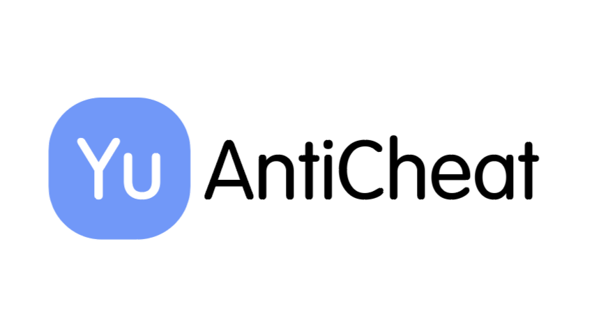

<h1>Yu Anti Cheat | Yu反作弊</h1>

## 简体中文 | SChinese

 展开 

### 反作弊~不能作弊哦！

### 你好啊~这里是YuAnitCheat！下面是一些有用的按钮，你可以点击看看！

### 使用教程
1. 打开后即启动
2. 若不是房主 部分功能需打开`非安全模式`（按下 `F5` 切换模式）

### 在`非安全模式`下 YuAC会做的操作
若检测到外挂 则多进行击杀一次

## 英文 | English

 Open 

### An anit cheat mod for Game `Among Us`

### Welcome to YuAnitCheat! Here are some useful buttons you can click to see!

### How to use
1. Open is start!
2. If you are not host,some must be `UnSelf Mode`（Press `F5` to change mode）

### In `UnSelf Mode`, YuAC will do
If the room has hacker,it will make an extra murder

## 多语言样式声明 | Multilingual style declarations

 展开 

## SChinese | 简体中文
这些模组不隶属于 Among Us 或 Innersloth LLC，其包含的内容也未得到 Innersloth LLC 的认可或以其他方式赞助。此处包含的部分材料是Innersloth LLC的财产。
## TChinese | 繁体中文
這些模組不隸屬於 Among Us 或 Innersloth LLC，其包含的內容也未得到 Innersloth LLC 的認可或以其他方式贊助。此處包含的部分材料是Innersloth LLC的財產。
## English | 英文
This mod is not affiliated with Among Us or Innersloth LLC, and the content contained therein is not endorsed or otherwise sponsored by Innersloth LLC. Portions of the materials contained herein are property of Innersloth LLC.
## French | 法文
Ce mod n'est pas affilié à Among Us ou à Innersloth LLC, et le contenu qu'il contient n'est pas approuvé ou autrement parrainé par Innersloth LLC. Certaines parties des documents contenus dans le présent document sont la propriété d'Innersloth LLC.
## Japanese | 日文
これらのモジュールは、Among UsまたはInnersloth LLCと提携しておらず、Innersloth LLCが承認またはその他の形でスポンサーとなっているコンテンツは含まれていません。 ここに含まれる資料の一部は、Innersloth LLCの所有物です。
## Russian | 俄文
Эти модули не связаны с Among Us или Innersloth LLC и не содержат контента, который был одобрен или иным образом спонсирован Innersloth LLC. Некоторые из содержащихся здесь материалов являются собственностью Innersloth LLC.

## Github仓库Star

`“良好的游戏环境需要玩家们的遵守 一个反作弊并不能维护这种环境”`

By Yu

